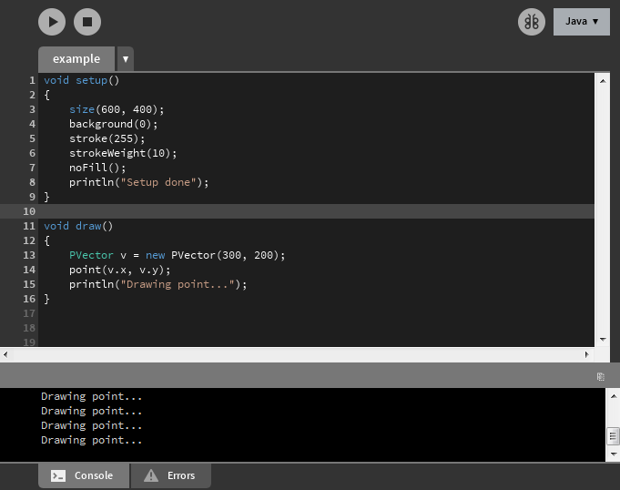

# Visual Studio Dark Theme for Processing

A Dark Theme for Processing that mimics the Visual Studio Dark Theme.
Thanks to [Jeff Thompson](#authors) for doing most of the hard work!

## How to install

There are only 2 steps in order to install this theme, but these steps vary by OS.

* Windows: 
    1. Copy the **content** of `VSDarkProcessingTheme\lib` into the `lib` folder where you installed Processing.
  For example, if you installed Processing in `C:\Program Files\processing-3.4`, then your `lib` folder is simply located in `C:\Program Files\processing-3.4\lib`.
    2. Copy `preferences.txt` into `C:\Users\[username]\AppData\Roaming\Processing`.
        To access the `AppData\Roaming` hidden folder, go to the Windows menu and type `%appdata%` in the search bar.
        The `Roaming` folder should appear. 
* Mac:
    1. Copy the **content** of `VSDarkProcessingTheme/lib` into `~/Applications/Processing.app/Contents/Java/lib`.
        To access this location, go to the Processing app, right-click and choose *Show Package Contents*.
    2. Copy `preferences.txt` into `~/Library/Processing`. To access this location, open a new Finder window, use the shortcut `Shift-Command-G` and paste `~/Library/Processing`. Hit the `Go` button and you're in!

## Screenshots

## Notes

* Last tested with [Processing 3.4 Win32 (26 July 2018)](http://download.processing.org/processing-3.4-windows32.zip).
* You can notice on the screenshot that the line numbers are not blue like in the VS Dark Theme: that's because the line numbers in Processing are closer to the code than in VS, so I decided to make them gray to avoid confusion.
* Still on the screenshot, you can see that the `PVector` keyword is not colored if it's placed after the `new` keyword. I couldn't find the right setting to fix this, and in fact I think it's not possible. Please tell me if you find it :)
* When using the theme, you will also notice that the primitive types (`float`, `int`...) are green like `PVector`, and not blue like in VS. That's because Processing doesn't make the difference between primitive types and custom types, so I decided to keep them green to avoid having too many blue in the code.

## Authors

* Special thanks to **[Jeff Thompson](https://github.com/jeffThompson/DarkProcessingTheme_3.0)**
* **[Arthur Cousseau](https://www.linkedin.com/in/arthurcousseau)**

## License

This project is licensed under the MIT License - see the [LICENSE.md](LICENSE.md) file for details